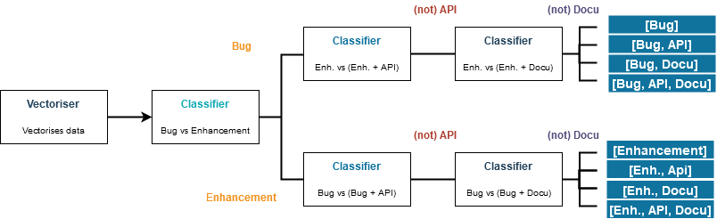

# Automatic issue classifier
## Introduction
In the context of software development projects, issues provide a vital tool to describe a variety of tasks to be accomplished by the team. Four of the most common types of issues are *feature requests*, *bug reports*, and tasks related to *documentation*, as well as tasks related to an *api*. The state-of-the-art involves manual classification of issues into their respective categories. While this requires marginal effort for projects of minimal scale with teams of comparably minimal size, large-scale projects involving multiple teams from different organisations pose a much larger problem in that regard. Mislabelling issues can lead to subsequent erroneous prioritisation of issues, resulting in misplaced time and energy. Furthermore, issues left unlabelled make it harder for project managers to pinpoint specific sources of errors and bugs in the software, whose impact can range from trivial to severe under certain circumstances.
## Problem statement
These problems can be summarised into one problem statement: Software development teams require accurate classification of every software project issue promptly, calling for the need of an automatic issue classifier. Several attempts have been made to curb variants of this problem, for example by developing a GitHub app to automatically classify issues. However, several key aspects are missing from them: None of them can be easily integrated into software projects spanning multiple components from separate teams using different issue management systems.
## Our solution
We are providing a possible solution by deploying an automatic issue classifier in form of a microservice which classifies issues based on their body texts, returning the suggested label(s) most appropriate for the issue.
>For example, a bug related to an API of a component could be labelled as both "bug" and "api", while additions to documentation "docu" and "feature request".

## How we addressed the issue
### Crawler
First we created a github [crawler](github_crawler/) which automatially crawls the issues from manually selected github repositories and saves them in into *.json* files.
> I.e. one crawls the bugs from the repository *demoRepo* made by person *MrSmith*, it will be saved as *MrSmith_demoRepo_bug.json* and the issues crawled will look like
> ```json 
> [{"labels":["bug"],"text":"Houston we have a problem"},{"labels":["bug"],"text":"..."},{"labels":["bug"],"text":"..."}]
Using the GitHub crawler those issues can also be inspected to check whether or not they make sense and further adjustments can be made - refer to the [crawler documentation](github_crawler/README.md) for more informations regarding the crawler and sanity checking.

### Issue classifier
After having crawled [multiple issues](issues/) we began creating issue classifiers and training them by using the crawled issues and issue- labels. \
But before classifying them, they have to be vectorized.\
The whole logic can be seen in the [classifier folder](classifier/) and by running [train.py](classifier/train.py) or running the [docker](Dockerfile) image.

#### **Vectorizer**
We trained an [tfidf vectorizer](https://scikit-learn.org/stable/modules/generated/sklearn.feature_extraction.text.TfidfVectorizer.html?highlight=tfidf#sklearn.feature_extraction.text.TfidfVectorizer) by giving it data to vectorized. We used the following adjustments
adjustment|why we made that adjustment
---|---
ngram: tuple = (1, 2) | ngrams are used to see the word in the context of their neighbors - it was decided against larger [ngrams](https://en.wikipedia.org/wiki/N-gram) due to the space complexity so it only takes unigram and bigrams
stripAccents=None | stripping non unicode caraters or not didn't make a whole lot of difference, because we used just english 
stopWords=None |...

**[TODO] word occurences > 3; did we use a logweighted one?**\
The trained vectorizer therefore takes the documents (also called issue bodies) and turns the words into pairs.
> i.e. "Hello world" => "hello", "world", "hello world" (due to the bi-gram (2-[ngram](https://en.wikipedia.org/wiki/N-gram)) and the unigram taken)\
> "hello", "world", "hello world" => [1,1,1] (which is [tf-idf](https://en.wikipedia.org/wiki/Tf%E2%80%93idf) weighted) 

So it basically takes documents and turns them into enourmous vectors.\
Vectors are the "language" of the classifiers and thus we can do fancy math related things with them. The vectorizer is trained on random documents of all the labels from multiple label-categories therefore it is not specialized on just one Classifier **[TODO see furhter research]** 

#### **Classifier**
We are using following estimators provided by sykit-learn.
estimators | modifications |
----|---
[MultinomialNB](https://scikit-learn.org/stable/modules/generated/sklearn.naive_bayes.MultinomialNB.html?highlight=multinomialnb#sklearn.naive_bayes.MultinomialNB)| -
[SGDClassifier](https://scikit-learn.org/stable/modules/generated/sklearn.linear_model.SGDClassifier.html?highlight=sgdclassifier#sklearn.linear_model.SGDClassifier)| (loss='modified_huber', penalty='l2',alpha=1e-3, random_state=100, max_iter=200)
[sigmoidSVM](https://scikit-learn.org/stable/modules/classes.html?highlight=svm#module-sklearn.svm) | SVC(kernel='sigmoid', gamma=1.0))
[RandomForest](https://scikit-learn.org/stable/modules/generated/sklearn.ensemble.RandomForestClassifier.html?highlight=randomforestclassifier#sklearn.ensemble.RandomForestClassifier)| RandomForestClassifier(200, bootstrap=False))
[LogisticRegression](https://scikit-learn.org/stable/modules/generated/sklearn.linear_model.LogisticRegression.html?highlight=logisticregression#sklearn.linear_model.LogisticRegression)| (solver='sag',random_state=100)

One can also take different classifiers, add or delete them.
Using those classifiers, each classifier receives a given vector and decides for itself whether or not an issue is i.e. a bug or an enhancement. 
> i.e. NaiveBayes gets [1,2,1,1] and returns *1* which means for example *bug* in classifying *enhancement vs bug*.

After each classifier decided what the issue describes, another classifier classifies their results and guesses the right answer (This method is called stacking, because one is stacking classifiers).
> so basically the results [1,0,0,1,...] are taken as an input by another classifier.

During our tests we found out, that a normal democratic majority vote outperforms this kind of stacking by about 1 Percent. Therefore we are letting the user decide, which kind they want to use. **[TODO]**\
\
As you can see those classifiers are just able to binary classify data as either class 1 or 0.\
Therefore we used multiple of those classifiers trained on binary input to create a binary tree. Due to the lack of multi- class trainings data. Otherwise we would have tried alternatives such as KNN, ...

#### **Tree logic**
To classify the issues we use a tree structure. Each issue passes through the tree depending on the assigned labels given by the previous nodes. The classifiers also consider this knowledge and were trained on special data sets.



#### **Antmap**
During training of the classifiers we created a "antmap" or thats at least what we are calling it. It's basically just a text document, which shows using emotes, which issues have been used for training, which for testing and whether or not an issues was labeled correctly.\
We used that observations to check whether or not the issues were labeled wrong or that our classifier was better in classifying than some humans.

## Microservice
After having classifiers which are able to classify given documents, we wanted to create an sacaleable and loosely coupled [microservice](microservice/). Refere to our [microservice documentation](microservice/README.md) for further information.\
The microservice looks as follows **[TODO architecture picture]**
It uses queues to communicate due to the **using a pattern similar to the hotpool pattern** to make it scalable for the future.\
Basically one runs the image and puts messages in the queue, afterwards a worker picks them up, vetorizes them, puts them in another queue and the three logic part starts. We decided us for using the tree logic with small classifiers, because of its scalable nature and further it uses the minimal amount of classifiers for each issue.
> i.e. if an issue is labeled *bug* it shouldn't be tested, if it is either *bug* or *api*, because we already have the prior knowledge, that it is an bug.

The classifiers can be added, removed or extended to ones likings, for examle we didn't use neuronal networks due to their complex nature and therefore hard understandable results. **[TODO see further research]**

Using this microservice architecture, we can extend the **TODO GROPIUS** tool by spethso to classify issues from github, jira and co.

## Further ideas to improve the classifer
- one vecorizer for each classifier, so that the vectorizer might are able to learn a bit more about the nature of the issues
- using deep learning to increase the performance
- ... **[TODO]**

---
## Extend the classifier creation or create your one ones
Please refer to the [documentation](classifier_doku/) for an quick overview and an better visualization of the inner workings of the classifier / vectorizer creation.
### instructions for creating classifiers
either run the docker image provided by running the [Dockerfile](Dockerfile) or by installing all the dependencies.s

#### By running the Dockerfile:
run those commands after installing [docker](https://www.docker.com/)\
`docker build -t classifierimg .`\
`docker run --name dockercont classifierimg`
in a console of choice.

#### By installing all dependencies:
1. Make sure you have at least `Python 3.7` installed.
2. Install all the necessary libraries.
   - numpy
   - pandas
   - seaborn
   - joblib
   - matplotlib.pyplot
   - sklearn
   - nltk
3. run [train.py](classifier/train.py). Make changes in the loadConfig.json to fit the training to your needs and change the classifiers / labels in train.py to train the specific classifier.

### Instructions for running the crawler
Just open the [crawler_and_analysis_tool](github_crawler/crawler_and_analysis_tool.html) and run the file.
and paste in the information required. The crawling status can be seen at the top of the page, after clicking on the "start" button.
To sanity check the issues crawled, just click on "prev" or "next" to change the current page

The crawler is also used as analysis tool for sanity checking after the issues have been downloaded, to use it as such, open the [github_crawler/crawler_and_analysis_tool.html](github_crawler/crawler_and_analysis_tool), click on "browse" and open the specific .json file.
To sanity check the issues crawled, just click on "prev" or "next" to change the current page 

## Directory structure
tree|explanation
---|---
Issue Classifier| The main folder
├┬── [classifier](classifier/)| Here lays the logic for all the classifiers
│└─── [trained_classifiers](classifier/trained_classifiers/)|Those are the pretrained classifiers
├─── [classifier_doku](classifier_doku)|The documentation of the `python` files in `classifiers` in form of `HTML` documents
├┬── [github_crawler](github_crawler/)|This folder contains the HTML file and the related files that allow you to crawl and analyze issues from GitHub repositories. Please refer to the [crawler documentation](github_crawler/README.md) for further information.
│├─── [scripts](github_crawler/scripts/)|Contains logic and libraries for the crawler
│└─── [style](github_crawler/style)|Contains style sheets for the crawler
├┬─── [issues](issues/)|This folder contains all crawled issues so far. 
│└─── [todo-add](issues/todo-add)|Issues which haven't been added yet
├┬── [microservice](microservice/)|This folder contains all the documents required to run the microservice. Please refer to the [microservice dokumentation](microservice/README.md) for further information
│├┬── [microservice](microservice/microservice/)|Here lays the logic for the microservice
││├┬── [classifier](microservice/microservice/classifier)|The logic for the classifier service
│││└───[trained_classifiers](microservice/microservice/classifier/trained_classifiers)|The pretrained classifiers
││└───[vectoriser](microservice/microservice/vectoriser)|The logic for the vectorizer service
│└─── [scripts](microservice/scripts)|**[TODO]**
└─── [results](results)|Some results we had on the way
