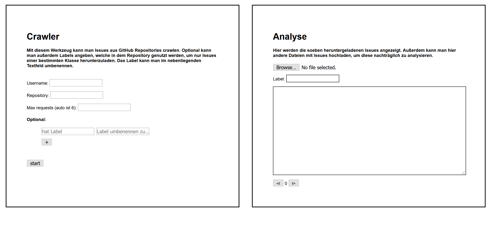

# Crawler Readme
This is the readme for the crawler, not for the general project.

## How to use the crawler
Just open the `crawler_and_analysis_tool.html` in an browser of choice. No extra dependencies required. 

## The crawler UI
The UI displayed will look something like this


----
#### **Crawling**:
To use the crawler, simply put a username and a reponame into the textfields.
> i.e. `T0B1K` and `IssueClassifier`

Afterwards add a max amount of requests which will be send by the crawler. Each request is able to receive about `100 issues`. The default number is 6 requests, to get more repo variance and not just a lot of issues from very few repositories.\
The optional category provides two textfields.\
The first one is used to crawl specific kinds of issues\
i.e. `bug` or `good first issue`\
the second one is used to map this label onto a label of choice.

> used for mapping `documentation` to `docu` and so on

With the `+` button more issue labels can be selected.\
Ater clicking on start, the issues are being crawled. And can be saved on the computer.\
The produced file is a `.json` file and looks something like this:
```json 
[{"labels":["docu"],"text":"Houston we have a problem"},{"labels":["docu"],"text":"..."}]
```
----
#### **Analysis:**
To use the analysis part, simply click on the `browse` button and choose a previously crawled JSON or one JSON file in the same format.\
Now click on one of the arrow keys `⊳` or `⊲` at the bottom. Now the number of issues are shown, the current issue body and the label of the issue.\
Just press the arrow keys to switch pages.\
Also the textarea is resizeable so one can resize it to ones liking.

## Repositories crawled:
We crawled the issues of the following repositories
- Vue